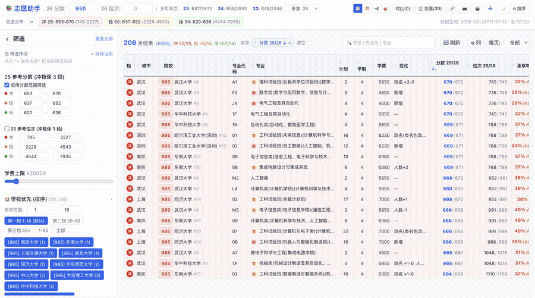
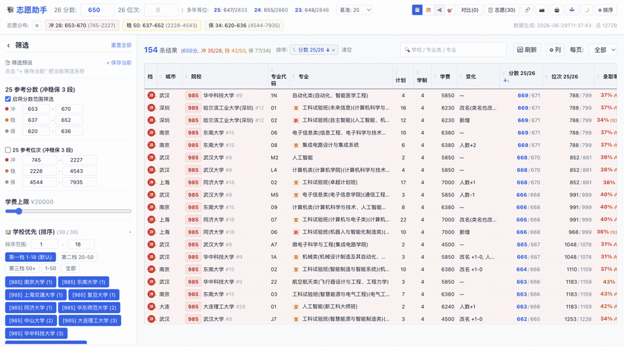
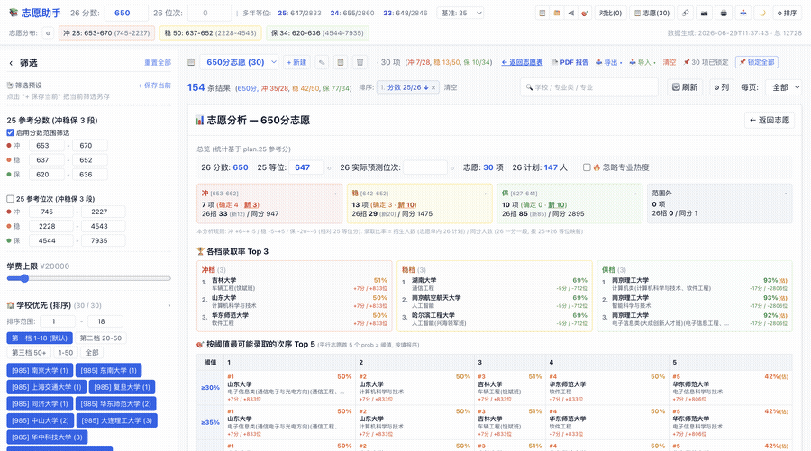

# zyhelper · 用户手册

> 给**志愿填报人**看 — 你不需要任何编程或数据准备能力, 打开浏览器就能用。
> 在线访问: <https://descreekert.github.io/zyhelper/>
> 数据范围: **2026 辽宁省 物理类** 本科招生计划 · 12,728 条志愿

---

## ✨ 5 分钟看懂这个工具

<table>
<tr>
<td width="33%" align="center">

### 🔎 选志愿
按城市 / 学校 / 专业 / 分数 多维筛选,挑出可冲可保的 plan

</td>
<td width="33%" align="center">

### 📋 报志愿
建多张志愿单,锁定顺序,导入导出官网格式 HTML

</td>
<td width="33%" align="center">

### 📊 分析志愿
看冲稳保比例 / 录取趋势 / 转专业风险, 一键导出 PDF

</td>
</tr>
</table>

  
   <em>场景 1 · 选志愿: 学校/城市/专业类优先档筛选 + 三栏分桶视图</em>

  
   <em>场景 2 · 报考: 进入志愿单 + 一键锁定 + 导出 官网格式 HTML</em>

  
   <em>场景 3 · 分析+PDF: 总览/Top 3/阈值表/转专业/趋势 → 一键生成 PDF 报告</em>

---

## 📑 目录

- [0. 5 分钟快速上手](#0-5-分钟快速上手)
- [1. 主视图 — 查询](#1-主视图--查询)
- [2. 志愿单 — 报考](#2-志愿单--报考)
- [3. 分析页 — 评估](#3-分析页--评估)
- [4. PDF 报告 — 一键导出](#4-pdf-报告--一键导出)
- [5. 常见问题 FAQ](#5-常见问题-faq)
- [6. 隐私 & 反馈](#6-隐私--反馈)

---

## 0. 5 分钟快速上手

1. 浏览器打开 <https://descreekert.github.io/zyhelper/> (建议 Chrome / Edge / Safari, **PC 优先**, 手机也能用但屏幕大点更舒服)
2. 顶部填 **26 高考分数** — 例 `650`。**26 位次** 会自动反查
3. 上方出现 **志愿分布**: `冲 N1 / 稳 N2 / 保 N3` chips,点击进任一档
4. 左侧 **筛选面板** 选城市 / 专业类 / 学校优先档 → 结果实时缩减
5. 列表右侧点 `➕` 把感兴趣的 plan 加进 **志愿单**
6. 切到 **📊 分析** 看冲稳保 / 录取趋势 / 转专业; 切到 **📄 PDF 报告** 导出完整报告

---

## 1. 主视图 — 查询

### 1.1 顶部工具栏

| 控件 | 说明 |
|----|----|
| **26 分数 / 26 位次** | 任填一个,另一个按一分一段自动反查 |
| **基准** | 用哪一年的等位分换算 25 等位分: 25 (默认) / 平均 / 24 / 23 |
| **多年等位** | 显示当前 26 分对应的 25/24/23 三年等位分位次 |
| **志愿分布 冲/稳/保 chips** | 三档分数+位次范围。点击 chip 等于"仅看该档" |
| **⚙ 比例调节** | 调整冲/稳/保 目标比例 + 总志愿数 (默认 25%/45%/30%, 112 项) |
| **📋 / 🗂 / ⫷ / 🎯** | 视图模式: 表格 / 卡片 / 三栏分桶 / 推荐 |
| **📋 志愿(N)** | 切到"我的志愿单" |
| **🔗 / 📷 / 🖨 / 📥** | 分享链接 / 截图保存 / 打印 / 导入预设 |
| **🌙 / ⚙ 排序 / ⋯** | 暗色主题 / 排序设置 / 更多菜单 |

### 1.2 筛选面板 (左侧)

- **关键字筛选** — 在结果上叠加 关键字 (前缀 `-` 可排除,例 `-生物 -化学`)
- **25 参考分数 / 位次 (冲稳保 3 段)** — 自动从 26 分数填充,可手调
- **学费上限**、**保研资格**、**985/211/双一流/省重点** 标签筛选
- **🏫 学校优先 / 🏙 城市优先 / 📚 专业类优先** — 按各档可选范围筛选,可在 `⚙ 排序` 中自定义档位
- **筛选预设** — `+ 保存当前` 把当前筛选另存为命名预设

### 1.3 列设置 (⋯ → 列管理)

可隐藏 / 显示 / 拖拽 列顺序,设置会持久化到浏览器。每列可拖拽边线调整宽度。

### 1.4 排序

- 点列表头 — 升降序切换
- `⚙ 排序` 弹出多键排序面板,可叠加多列 + 拖拽 reorder + 单独切方向

---

## 2. 志愿单 — 报考

### 2.1 多列表 + 切换

- 顶部下拉切换不同志愿单 (例 "650 分志愿" / "退而求其次")
- 右侧 `新建` / `重命名` / `复制` / `删除` 按钮
- 每个志愿单独立锁定/待确认/备份

### 2.2 排序与锁定

| 行操作按钮 | 含义 |
|----|----|
| `↑↓⤒⤓` | 向上 / 向下 / 置顶 / 置底 |
| `📌` | 锁定到当前位置 (整理时不被自动重排打乱) |
| `📌 锁所有` | 一键锁全部当前项 |
| `⏳` 待确认 (橙) | 整理排序中的临时状态。`✓ 全部确认` 升为 📌; `↩ 全部撤销` 回滚到编辑前 |
| `🗑` | 移出志愿单 |

> 多选: 拖动选区 / Ctrl 单击切换 / Shift 范围。可批量上下移动。

### 2.3 自动排序

未锁定的 plan 按 **26 等位次升序** 排列 (高位次在前)。锁定的项停在原位置, 未锁项填空位。

### 2.4 导入 / 导出

**📤 导出 ▾**

| 选项 | 用途 |
|----|----|
| HTML — 官网格式 | 模板化生成辽宁招生考试网正式版,可上传/打印 |
| HTML — 官网预选模式 | 模板化生成预选版,单表 |
| HTML — 简洁版 (打印) | 自定义简洁打印样式 |
| JSON | 全量导出 (含 plan ID,跨设备/版本可导入) |
| CSV | 6 列 (序号/院校代号/院校名称/专业代号/专业名称/专业备注) + UTF-8 BOM |
| CSV — 按 冲稳保 档 | CSV + 档 列 |

**📥 导入 ▾**

| 选项 | 用途 |
|----|----|
| HTML — 官网/预选 (自动识别) | 解析辽宁招考网导出的 HTML, 自动识别批次 |
| JSON | 还原 全量 |
| CSV | 行 = 1 志愿,自动按 院校代号+专业代号 / 院校名+专业名 匹配 |

**导入行为**:
- **空表 / 替换 / 新建** → 严格保留源文件顺序, 全部 📌 锁定
- **合并到非空表** → 新增项不锁定, 与现有项按 26 等位次自动重排

---

## 3. 分析页 — 评估

### 3.1 总览 + Anchor 调整

- **26 分数 / 25 等位 / 26 实际预测位次** — 默认自动,可手调
- **🔥 忽略专业热度** checkbox — 计算录取率时把电子信息 / 计算机 等热度调整 (-4%/-3%) 当作 0
- 冲/稳/保/外 四张卡 — 点开看该档详细 plan 表 (含 ✓OK / ⚠ 需转 / ✗ 错 标记)

### 3.2 🏆 各档录取率 Top 3 + 🎯 阈值 Top 5

- **Top 3**: 冲/稳/保 三档 各自概率最高的 3 项 (含 学校 / 专业 / 概率 / Δ分位差)
- **Top 5**: 11 个阈值 (30%-80% 步 5%) × 5 列,展示"平行志愿首 5 个" prob ≥ 阈值 的志愿

### 3.3 🎓 转专业风险扫描

- 2 个清单: **目标专业** (无需转) / **可接受转入**
- 默认内置 26 个目标 + 4 个可接受 (✎ 编辑清单 可改, 失焦自动保存; ⟲ 默认 重置)
- 3 张汇总卡: ✓ 无需转 / ⚠ 需转 / ✗ 不在范围 (点击展开看清单)
- **匹配规则**:
  - **单专业**: 主名直接在 目标 / 可接受 → ok / warn
  - **大类**: 子专业含任一 目标 → ok; 否则含任一 可接受 → warn; 都没有 → error

### 3.4 📈 录取趋势图

- 橙色折线: 每个志愿的预测录取概率,X 轴 = 志愿顺序
- 蓝色虚线: 当前阈值
- 阈值首达点 (绿点): 每个阈值 (50%-95% 步 5%) 首个 prob ≥ 阈值 的志愿
- **互动**:
  - 拖动滑杆 (1% 步进, 0-99%)
  - 点 Y 轴数字 (0/20/40/60/80/100 快捷)
  - 点击概率分布柱状图 (10% 分桶)
  - 点 SVG 任意 Y 位置 → 精确设置阈值
  - 鼠标移到曲线上 → tooltip 显示具体志愿 (含 Δ 分位次)
- 阈值下方动态表: 列出所有 prob ≥ 阈值 的志愿全表

### 3.5 录取率算法简述

录取率 = `sigmoid(位次差 / 1500 + 0.4)` + 供给率加成 + 专业热度调整,详细公式见 [开发者文档](DEVELOPER_GUIDE.md#录取率算法)。**对于普通用户**,理解 4 点足够:

1. **位次差** = 你的预测位次 vs plan 历史位次。差异大 → 概率偏一边
2. **专业热度**: 电子信息 -4% / 计算机 -3% / 自动化 -1.5% / 等 — 热门专业实际录取分会比历史值高
3. **供给率**: 该分数总招生 / 同分人数 > 0.85 时,录取率 +10pp
4. **新增专业** 用 `ref25 + 5` 反查粗估,标 `(估)`

### 3.6 多维度聚合

- 按分数 (一分一段) + 按学校 (并排)
- 按报考专业 (主名收敛, 例 `机械设计制造及其自动化(卓越)` 与 普通版合并)
- 按城市
- 招生维度聚合: 2026 全体 plans 在冲稳保整体范围内 各 25 分总招生

每个聚合可点行展开 → 看明细 plan 列表。

---

## 4. PDF 报告 — 一键导出

切到 `📄 PDF 报告` → `🖨 打印/保存 PDF` → Chrome "另存为 PDF" (推荐 A4)。

包含 **15 个 section** 完整覆盖志愿表 + 分析 + 多维度聚合,送给家长/老师参考最直观。

| # | Section | 内容 |
|---|----|----|
| 1 | 总结与建议 | 分数范围 / 冲稳保占比 / 风险提示 / Top 3 / 阈值 Top 5 |
| 2 | 录取趋势图 | 折线 + 阈值首达点 + 直方图 |
| 3 | 完整志愿表 | 按填报顺序 (录取率 + (估) + 🔥 热度) |
| 4 | 志愿详情 | 每条卡片 + 全字段 |
| 5 | 分析总览 | 冲稳保占比 |
| 6 | 冲稳保详情 | 6.1/6.2/6.3 |
| 7 | 分数总览 | 按 25 分聚合 |
| 8 | 分数详情 | 你的志愿 + 2026 全体招生来源 |
| 9 | 学校总览 | 含校录取率 |
| 10 | 学校详情 | 每校志愿列表 |
| 11 | 报考专业总览 | 按主名 |
| 12 | 报考专业详情 | 每专业 志愿列表 |
| 13 | 城市总览 | 按城市 |
| 14 | 城市详情 | 每城市 志愿列表 |
| 15 | 转专业风险扫描 | 目标 + 可接受 清单 + 3 张汇总卡 + 各档表 |

---

## 5. 常见问题 FAQ

<b>Q: 输入 26 分数后位次没自动填?</b>

通常是浏览器缓存问题。在 URL 后加 `?v=now` 强刷,或清浏览器缓存再访问。

<b>Q: 录取率显示 "新?" / "(估)"?</b>

该 plan 是 2026 新增专业, 无 25 年参考。算法用"该专业 25 ref 分 + 5"反查位次粗估,标 `(估)`,准确度有限。

<b>Q: 转专业判定为 ✗ 错, 但该专业明明在我的目标里?</b>

检查名称是否完全一致 (例 "微电子科学与工程" 写成 "微电子科学与技术")。点 `✎ 编辑清单` 改名即可,改完自动保存。

<b>Q: PDF 打出来跨页内容被截断?</b>

Chrome 打印对话框选 A4 + 边距 ≥ 8mm,关掉页眉页脚。

<b>Q: 导入辽宁 HTML 志愿表后少了几条?</b>

查看导入提示的 "未匹配 N 项" — 通常是学校改名 / 专业名变更。可手动用筛选页找到对应 plan 后 `➕` 加进去。

<b>Q: 我换电脑了, 志愿单丢了?</b>

应用数据存在浏览器本地。换设备前 `📤 导出 ▾ → JSON`,新设备 `📥 导入 ▾ → JSON` 完整恢复 (含锁定/待确认状态)。

<b>Q: 手机能用吗?</b>

可以,但屏幕窄,推荐横屏。复杂筛选 + 多列表格 在 PC 上体验更好。

---

## 6. 隐私 & 反馈

- **所有数据** (志愿单 / 配置 / 锁定状态 / 浏览历史) **仅存浏览器本地 localStorage**, 不上传任何服务器
- 应用是纯静态 SPA, 部署在 GitHub Pages, 无后端
- 你的高考分数 / 位次 / 志愿 **完全本地**, 清空浏览器数据即清空

**反馈**: GitHub Issues <https://github.com/descreekert/zyhelper/issues>
